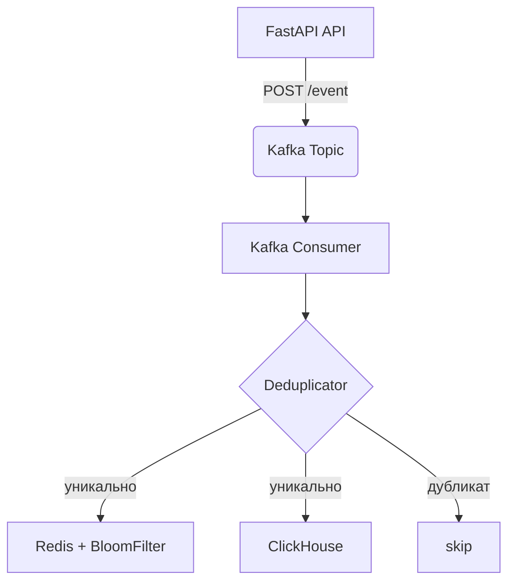

🎯 Event Deduplication Microservice

### 📌 Назначение
Микросервис для приёма, фильтрации и хранения уникальных событий, основанный на связке FastAPI, Kafka, Redis, ClickHouse и Bloom-фильтра.

---

### ⚙️ Компоненты системы

#### 1. **FastAPI-приложение (`main.py`)**
- **Роут:** `POST /event`
- **Функциональность:** Принимает событие в формате `Event`, генерирует UUID, сериализует событие и отправляет в Kafka.
- **Kafka Producer:** Инициализируется на старте приложения.
- **Зависимости:**
  - `aiokafka.AIOKafkaProducer`
  - `pydantic.BaseModel`
  - `.env` с переменной `TOPIC`

#### 2. **Kafka (брокер сообщений)**
- **Используется как очередь между API и обработчиком событий**
- **Топик:** По умолчанию `events` (настраивается через `.env`)

#### 3. Consumer (consumer.py)**
- Kafka Consumer: асинхронно читает события из топика Kafka (aiokafka.AIOKafkaConsumer)**
- Дедупликация: каждое сообщение проверяется через Deduplicator.is_duplicate(event)
- Очередь обработки: уникальные события помещаются в асинхронную очередь asyncio.Queue для последующей обработки
- ClickHouse: при запуске создаётся таблица событий через ClickHouseManager.create_events_table()
- Логирование: сообщения о дубликатах, ошибках и статусах выводятся в консоль
🧼 Грейсфул-шатдаун:
Обработка сигналов SIGINT и SIGTERM
Остановка Kafka consumer и закрытие Redis-подключения
Очистка очереди событий и завершение всех задач (в том числе воркеров, если используются)

🔧 ENV-переменные:

env
Копировать
Редактировать
TOPIC=events
KAFKA_BOOTSTRAP=kafka:9092
GROUP_ID=events-group
REDIS_HOST=redis
CLICKHOUSE_HOST=clickhouse
CLICKHOUSE_PORT=9000
CLICKHOUSE_USER=default
CLICKHOUSE_PASSWORD=my_password
CLICKHOUSE_DB=default

#### 4. **Deduplicator (`deduplicator.py`)**

- **Назначение:** Класс для дедупликации событий, использующий Redis, Bloom-фильтр и ClickHouse для проверки уникальности событий.
  
- **Проверка на дубликаты:**
  - Метод `is_duplicate(event)`:
    - Хэширует событие.
    - Проверяет наличие хэша в Redis.
    - Проверяет наличие в Bloom-фильтре.
    - Если событие не найдено в Redis или Bloom-фильтре, проверяет ClickHouse на наличие события.
    - Если событие найдено в ClickHouse, оно сохраняется в Redis с TTL и добавляется в Bloom-фильтр.
    - Если событие уникально, оно регистрируется в Redis, Bloom-фильтре и ClickHouse.

- **Управление Bloom-фильтром:** Метод `_cleanup_bloom_filter()` очищает Bloom-фильтр каждый час.

- **Технические детали:**  
  - Используется библиотека `pybloom_live` для Bloom-фильтра.
  - Хэширование события осуществляется через `hashlib`.
  - Сериализация события выполняется в формат JSON с сортировкой ключей.
  
- **Параметры и настройки:**
  - `redis_ttl`: Время жизни ключей в Redis (по умолчанию 2 часа).
  - Использует асинхронные вызовы для взаимодействия с Redis и ClickHouse.


#### 5. **ClickHouseManager (`clickhouse_manager.py`)**

- **Назначение:** Класс-менеджер для работы с базой ClickHouse (обёртка над `clickhouse_driver.Client`).
- **Создание таблицы:** Метод `create_events_table()` создаёт таблицу `events`, если она ещё не существует.  
  Таблица:
  - `event_hash` — хэш события (уникальный ключ)
  - `event_data` — сериализованное JSON-событие
  - `created_at` — время поступления события  
  Удаление старых данных происходит автоматически по TTL: `created_at + 7 дней`.
  
- **Проверка на дубликаты:**  
  Метод `is_duplicate(event_hash)` проверяет, существует ли уже событие с таким хэшем в ClickHouse.

- **Сохранение события:**  
  Метод `insert_event(event_hash, event)` сериализует событие в JSON и сохраняет его с текущим временем в таблицу `events`.

- **Асинхронность:**  
  Все запросы выполняются асинхронно с помощью `asyncio.run_in_executor(...)`, поскольку ClickHouse клиент синхронный.

 Структура таблицы ClickHouse:
```sql
CREATE TABLE IF NOT EXISTS events (
    event_hash String,
    event_data String,
    created_at DateTime
) ENGINE = MergeTree()
ORDER BY event_hash
TTL created_at + INTERVAL 7 DAY
SETTINGS ttl_only_drop_parts = 1;
```
ENV-переменные:
env
Копировать
Редактировать
CLICKHOUSE_HOST=clickhouse
CLICKHOUSE_PORT=9000
CLICKHOUSE_USER=default
CLICKHOUSE_PASSWORD=my_password
CLICKHOUSE_DB=default

## 📊 Результаты Нагрузочного Тестирования

### Конфигурация Машины

- **CPU:** 8 × 3.3 ГГц
- **RAM:** 16 ГБ
- **NVMe:** 20 ГБ
- **ОС:** Ubuntu 22.04

### Результаты Тестирования POST /event

| Тип   | Имя       | Количество запросов | Количество ошибок | Медиана (мс) | 95-й персентиль (мс) | 99-й персентиль (мс) | Среднее (мс) | Минимум (мс) | Максимум (мс) | Средний размер (байт) | RPS  | Ошибки/с |
|-------|-----------|---------------------|-------------------|--------------|----------------------|----------------------|--------------|--------------|---------------|-----------------------|------|----------|
| POST  | /event    | 232111              | 0                 | 150          | 230                  | 280                  | 162.31       | 101          | 938           | 91                    | 596  | 0        |
| **Итого** |           | **232111**            | **0**             | **150**      | **230**              | **280**              | **162.31**   | **101**      | **938**       | **91**                | **596**| **0**    |

### Объяснение Метрик:

- **# Requests (Запросы):** Общее количество выполненных запросов.
- **# Fails (Ошибки):** Общее количество неудачных запросов.
- **Median (мс):** Время отклика 50% запросов.
- **95%ile (мс):** Время отклика для 95% запросов.
- **99%ile (мс):** Время отклика для 99% запросов.
- **Avg (мс):** Среднее время отклика для всех запросов.
- **Min (мс):** Минимальное время отклика.
- **Max (мс):** Максимальное время отклика.
- **Avg size (байт):** Средний размер ответа.
- **RPS (Запросов в секунду):** Среднее количество запросов в секунду.
- **Failures/s (Ошибок в секунду):** Среднее количество ошибок в секунду.

### Выводы:

- Нагрузочное тестирование показало отличные результаты с **0 ошибками** при **232111** запросах.
- Время отклика в **99% случаев** не превышает **280 мс**, что свидетельствует о хорошей производительности.
- Средний размер ответа составляет **91 байт**, что указывает на эффективность обработки запросов.
тесты проводились по  locust -f locustfile.py --host=http://103.74.93.169:8000                                              
фаил для тестов locustfile.py в корне проекта
### 🔄 Поток обработки события



---


---

### 📌 Примечания
- Все события проверяются по хешу всех ключей предстввленного json, есть в корне проекта